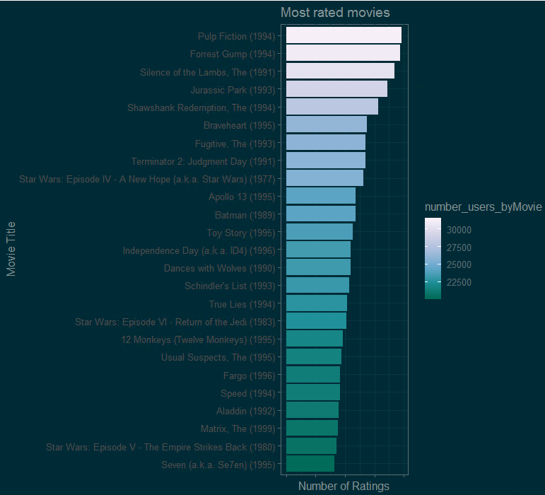

```{r knitr_init, cache=FALSE,echo=FALSE}
library(knitr)
library(rmdformats)

## Global options
options(max.print="75")
opts_chunk$set(prompt=FALSE,
               tidy=TRUE,
               comment=NA,
               message=FALSE,
               fig.align='center',
               warning=FALSE)
opts_knit$set(width=75)
```


  
# *Abstract*

<br> <br>
Recommender systems algorithms are applied into industry on various business domains. The most popular are: 
<br> <br>
-The **movie recommendations** like the one used by Netflix. 

-And the **(related items recommendations)** during online purchases.
<br> <br>
There are 2 types of recommender systems: 

-**Content Filtering** : Based on the description of the item also called meta data or side information

-And **Collaborative Filtering**: Are calculating the similarity measures of the target ITEMS and finding the minimum (Euclidean distance, or Cosine distance, or other metric, it depends on the algorithm). This is done by filtering the interests of a user, by collecting preferences from many users *(collaborating)*.
<br> <br>
**Matrix factorization  with parallel stochastic gradient descent**, is an effective algorithm used to create a recommender system.The approach is to approximate the rating matrix:
<br> <br>
$R_{m\times n}$ 
by the product of two matrixes containing lower dimensions, 
$P_{k\times m}$ and $Q_{k\times n}$, in a way that
$$R\approx P^\prime Q$$
<br>
For Ex. $p_u$ is the $u$-th column of $P$, and $q_v$ is the $v$-th column of $Q$, 
then the movie rating placed by the user $u$ on the item $v$ would be predicted as
$p^\prime_u q_v$.

<br>
A usual equation for the $P$ and th  $Q$ is given by the below optimization problem :
<br> <br>

$$\min_{P,Q} \sum_{(u,v)\in R} \left[f(p_u,q_v;r_{u,v})+\mu_P||p_u||_1+\mu_Q||q_v||_1+\frac{\lambda_P}{2}
                                     ||p_u||_2^2+\frac{\lambda_Q}{2} ||q_v||_2^2\right]$$
<br> <br>
where the $(u,v)$ are the locations of the real entries in the $R$, 
$r_{u,v}$ is the real rating, $f$ is the loss function, 
and $\mu_P,\mu_Q,\lambda_P,\lambda_Q$ are the usual penalization parameters used by many algorithms to avoid
overfitting.
<br> <br>
The procedure of solving the matrix $P$ and $Q$ is the model training, 
and the selection of choosing penalization parameters is the hyper parameters tuning.
After obtaining the $P$ and the $Q$, 
<br> <br>
we can then predict :
<br> <br>
$\hat{R}_{u,v}=p^\prime_u q_v$.
<br> <br>
Many thanks to Yixuan Qiu from Carnegie Mellon University
Source:
[Yixuan](https://github.com/yixuan/)
<br>

# Introduction 
<br> <br>
The purpose of this R project is to create a  **rating recommender system through machine learning training.** 
That recommender system will be able to predict  a users rating into a new movie. Or the user preference for a
movie.
<br> <br>
The most famous recommender training event was the competition launched by **Netflix with one milion dollar price.**
I will use the 10M (millions) rows rating dataset named MovieLens created by the  University of Minnesota. It was released at 
1/2009 so our newest movies  are until 2008. In order to find a pattern and behavior of the data, the data sets where "enhanced"
by many new features (dimensions). As validation of the models i wil use RMSE (regression approach). During the project more explanation is given. 
<br> <br>
Many algorithms and data transformations where applied in order to achieve the lowest RMSE. 
Such us: 

-**Matrix Factorization with parallel stochastic gradient descent**
-**H2o stacked ensembles of (GBM,GLM,DRF,NN)**
-**H2o Deep Learning (Neural Networks)**
-**H2o Gradient Boosting Machine (GBM)**
-**H2o Auto ML**

<br> <br>
*collaborative filtering* underlying assumption is that if a person X has the same opinion as a person Y then
the recommendation system should be based  on preferences of person Y (similarity). I will 
enhance the collaborative filtering with the application of:

-**Matrix Factorization with parallel stochastic gradient descent algorithms**. MF is a class of collaborative
filtering algorithms used in recommender systems. Matrix factorization algorithms work by **decomposing the **
**user-item interaction matrix into the product of two loir dimensionality rectangular matrices**. 

This family of methods became **widely known during the Netflix prize challenge** due to its effectiveness as reported by Simon Funk in his 2006 blog where he shared his findings with the research community.

[recosystem](https://en.wikipedia.org/wiki/Matrix_factorization_(recommender_systems)

We will apply **Matrix Factorization with parallel stochastic gradient descent**. With the help of *"recosystem"*
package it is an R wrapper of the LIBMF library which creates a  Recommender System by Using Parallel Matrix Factorization. 

-The main task of recommender system is to predict unknown entries in the rating matrix based on observed values. 

More info on the recosystem package and the techniques 

[recosystem](https://cran.r-project.org/ib/packages/recosystem/vignettes/introduction.html)

[CONTACT]:(https://www.linkedin.com/in/niko-papacosmas-mba-pmp-mcse-695a2695/)
<br>
`Loading of the required libraries`
  
```{r, echo=TRUE,warning=FALSE, message=FALSE }
  
  require(tidyverse)
  require(caret)
  require(rmarkdown)
  require(plotly)
  require(rpart)
  require(lattice)
  require(ggthemes)
  require(GGally)
  require(knitr)
  require(tidyr)
  require(wordcloud)
  require(kableExtra)
  require(RColorBrewer)
  require(dplyr)
  require(ggplot2)
  require(lubridate)
  require(h2o)
  require(stringr)
  require(formatR)
  require(recosystem)
  require(knitr)
```
```{r, echo=FALSE, warning=FALSE, message=FALSE,cache=TRUE }
    
load("movielens_env.RData")
```


# Data Observation
<br> <br>
`Data structure of the edx (training set)`

```{r , echo=FALSE}
glimpse(edx) 
```
Its class'data.frame'with :	
-9000047 obs (rows) 
-6 variables (features)
<br> <br>
The same movie entry might belong to more than one genre. Every discrete rating is on a discrete row.
<br> <br>
`First entries of the edx (training set)`
```{r , echo=FALSE}
head(edx)
```
<br> <br>
It looks we have to transform the timestamp which represents the (rating date), since the release date is inside the movie (title) column.
<br> <br>
We will extract the release date from the movie title. And we will create a new matrix with more dimensions, containing every movie genre separately  as factor.
<br> <br>
`Summary of the edx (training set)`
```{r , echo=FALSE}

summary(edx)
```
<br> <br>
The rating mean shows that users **are rating above the average rating (3.512)** *right skewed*
 <br> <br>
-**Rating (our dependent variable y) has 10 continuous values from 0 until 5.** Its row has one given rating by one user for one   movie.
 <br> <br>
-Rating is our dependent (target variable) y  
-userId, movieId, timestamp (date&time) are: quantitative - Discrete unique numbers.  
-Title and genres are: qualitative and not unique.  
<br> <br>
`Data structure of the validation (testing set)`

```{r , echo=FALSE,null_prefix =TRUE}
glimpse(validation)
```
<br> <br>
Its class 'data.frame': With	999999 obs. of  6 variables: Its exactly the 10% of our training set. And has the same 6 features
<br> <br>
`First entries of the validation (testing set)`
```{r , echo=FALSE,null_prefix =TRUE}
head(validation)
```
Same as our training set. So we will perform the same data transformation  on both training and test datasets.
we mentioned earlier we could **add features in our datasets in order to analyse for** correlations,** and if they exist they would help our ML models. By adding a feature**of release year and year rated. So we will create 2 new dataframes with that  features for train set and test sets.
 <br> <br>
`We will transform timestamp to year rated, and extract the premier data from the movie title and add it as a separate feature.`
```{r , echo=TRUE, cache=TRUE}
edx <- edx %>% mutate(timestamp = as.POSIXct(timestamp, origin = "1970-01-01", tz = "GMT"))
edx$timestamp <- format(edx$timestamp, "%Y")

colnames(edx)

names(edx)[names(edx) == "timestamp"] <- "year_rated"

releaseyear <- stringi::stri_extract(edx$title, regex = "(\\d{4})", comments = TRUE ) %>% as.numeric()


edx <- edx %>% mutate(release_year = releaseyear)


validation <- validation %>% mutate(timestamp = as.POSIXct(validation$timestamp, origin = "1970-01-01", tz = "GMT"))
validation$timestamp <- format(validation$timestamp, "%Y")

colnames(validation)

names(validation)[names(validation) == "timestamp"] <- "year_rated"

releaseyear2 <- stringi::stri_extract(validation$title, regex = "(\\d{4})", comments = TRUE ) %>% as.numeric()


validation <- validation %>% mutate(release_year = releaseyear2)
```
`Check the data sets for consistency`
```{r , echo=FALSE}

head(edx)
head(validation)
```

`Display the distinct number of users and distinct number of movies in our train set`
```{r , echo=TRUE,null_prefix =TRUE,cache=TRUE}

edx %>%
  summarize(distinct_users = n_distinct(userId),
            distinct_movies = n_distinct(movieId))
```

`We create and display a new df with useful  metrics in order to understand better our dataset and identify  outliers.`

```{r , echo=TRUE,cache=TRUE}

edx_movies_metrics <- edx %>%
  separate_rows(genres,
                sep = "\\|") %>%
  group_by(genres) %>%
  summarize(Ratings_perGenre_Sum = n(),
            Ratings_perGenre_Mean = mean(rating),
            Movies_perGenre_Sum = n_distinct(movieId),
            Users_perGenre_Sum = n_distinct(userId));
edx_movies_metrics;
```
We observe that the rating mean is not rounded  so we will fix it. Also we identify in our new edx movies metrics df that there is one movie without genres.
<br/>
We will treat it as an outlier and delete it from all our datasets, since it doesnt add any value. We also have 19 distinct genres.  
<br/>
`Display the genres with the most rated movies (not distinct movies)`
```{r , echo=TRUE,cache=TRUE}

edx_movies_metrics$Ratings_perGenre_Mean <- round(edx_movies_metrics$Ratings_perGenre_Mean, digits = 2)

edx_movies_metrics[order(-edx_movies_metrics$Movies_perGenre_Sum),]
```
**We can observe that most movies are in the above genres**
<br/>
*(Reminder)* those are not distinct movies. Because as we observed earlier one movie might
belong to more than one genre

`Display of the genres - with the most distinct ratings`
```{r , echo=TRUE}
edx_movies_metrics[order(-edx_movies_metrics$Ratings_perGenre_Sum),];
```
**Here we observed that the top 3 genres with the most ratings are**    

**-Drama**  
**-Comedy and**  
**-Action**  

**Some genres have exponential low sum of ratings so probably they will be also treated as outliers in the data frame  that we will create with all genres as factors**  
<br/>
`Display of ratings mean - per genre`
```{r , echo=TRUE,cache=TRUE}

edx_movies_metrics[order(-edx_movies_metrics$Ratings_perGenre_Mean),]
```
**Here we can observe that genres with low sum of ratings have higher rating mean. This is one more** **indicator that should be treated as outliers.**
Also movies with low sum of ratings will be removed from the training set for the same reasons

`We create also for our training set a metrics df`
<br/>
```{r , echo=TRUE,cache=TRUE}

validation_movies_metrics <- validation %>%
  separate_rows(genres,
                sep = "\\|") %>%
  group_by(genres) %>%
  summarize(Ratings_perGenre_Sum = n(),
            Ratings_perGenre_Mean = mean(rating),
            Movies_perGenre_Sum = n_distinct(movieId),
            Users_perGenre_Sum = n_distinct(userId))


validation_movies_metrics$Ratings_perGenre_Mean <- round(validation_movies_metrics$Ratings_perGenre_Mean, digits = 2)


validation_movies_metrics <- subset(validation_movies_metrics, genres!="(no genres listed)")
```

`We create a ratings distribution df`
```{r , echo=TRUE,cache=TRUE}
ratings_distribution <- edx %>%
  group_by(rating) %>%
  summarise(ratings_distribution_sum = n()) %>%
  arrange(desc(ratings_distribution_sum))
```

`Display of the ratings distribution`
```{r, echo=FALSE, warning=FALSE,message=FALSE,cache=TRUE}

kable(ratings_distribution) %>%
kable_styling(bootstrap_options = "striped", full_width = F , position ="center") %>%
column_spec(1,border_left = T) %>%
column_spec(2,bold = T, border_right = T) %>%
footnote(general = "Ratings distribution",
footnote_as_chunk = T)

ratings_mean <- mean(edx$rating)
```


`Interactive histogram of the ratings distribution`
```{r ,out.width='80%', echo=TRUE,null_prefix =TRUE,cache=TRUE}

p1 <- ggplot(edx,aes(rating, fill=cut(rating, 100))) +
  geom_histogram(color = "blue",binwidth = 0.2) +
  scale_x_continuous(breaks = seq(0.5, 5, 0.5)) +
  geom_vline(xintercept = ratings_mean,
             col = "red",
             linetype = "dashed") +
  labs(title = "Distribution of ratings",
       x = "Ratings Scale",
       y = "Sum Of Rating") +
  theme(axis.text=element_text(size=10),plot.title = element_text(size = 11, color = "darkblue", hjust = 0.5))
ggplotly(p1)
```


For the training of our ML algorithms we want to **penalized  movies rated by low number of users.So in order to put more weight on movies that have been rated by more people, we will add 2 more features in our data sets.  **  
<br/>
**-Number of users per movie and  **    
 **-Number of movies per user( how many movies had that user rated ). So movies and users that have not many rates will be penalized during the ML training **  
`Add new dimensions: Number of movies per user. And number of users per movie`
```{r , echo=TRUE,null_prefix =TRUE,cache=TRUE}
edx <- edx %>%
  group_by(userId) %>%
  mutate(number_movies_byUser = n());


edx <- edx %>%
  group_by(movieId) %>%
  mutate(number_users_byMovie = n()); 


validation <- validation %>%
  group_by(userId) %>%
  mutate(number_movies_byUser = n());


validation <- validation %>%
  group_by(movieId) %>%
  mutate(number_users_byMovie = n()); 
```

`Interactive plot of the most rated movies (Only those that have been rated over 20.000 times)` 

```{r,eval=FALSE }

edx %>% filter(number_users_byMovie >= 20000) %>%
  ggplot(aes(reorder(title, number_users_byMovie), number_users_byMovie, fill = number_users_byMovie)) +
  geom_bar(stat = "identity") + coord_flip() + scale_fill_distiller(palette = "PuBuGn") + xlab("Movie Title") +ylab('Number of Ratings') +
  ggtitle("Most rated movies") +
 theme(axis.text.x = element_text(angle = 90)) +

```



<br/>
`Interactive bar graph display: in order to understand the distribution of the sum of ratings per genres,and movies per genres`
```{r ,dpi=96,out.width='80%', echo=TRUE,null_prefix =TRUE}

ggplot(data=edx_movies_metrics, aes(x= reorder(genres, -Ratings_perGenre_Sum),
                                    y = Ratings_perGenre_Sum,colour= "red", fill=genres, label= Ratings_perGenre_Sum)) + 
  xlab("Movies genres") + ylab("Sum of ratings in Mio") +
  ggtitle("Sum of ratings per genre") +
  scale_y_continuous(labels = scales::comma) +
  theme_solarized(light=FALSE) +
  theme(axis.text.x = element_text(angle = 90)) +
  geom_col()
```

<br/>
In the bar graph is also clear that the **distribution is not equal in all genres. After the fantasy genre, we can see the exponential growth in the number of ratings. **    
 **That is an indication that probably we wil penalize the genres with low number of ratings, in our model **
<br/>
`Word count cloud plot - with the most rated genres`
```{r ,out.width='80%', echo=TRUE,null_prefix =TRUE,cache=TRUE}

wordcloud(words = edx_movies_metrics$genres, freq = edx_movies_metrics$Ratings_perGenre_Sum, min.freq = 10,
          max.words=10, random.order=FALSE,random.color=FALSE, rot.per=0.35,scale=c(5,.2),font = 4, 
          colors=brewer.pal(8, "Dark2"),
          main = "Most rated genres")
```

<br/>
`Bar graph plot to observe - the distribution of ratings mean - per genres`
```{r , dpi=150,out.width='80%', echo=TRUE,null_prefix =TRUE,cache=TRUE}

ggplot(data=edx_movies_metrics, aes(x= reorder(genres, - Ratings_perGenre_Mean),
                                    y = Ratings_perGenre_Mean,colour= Ratings_perGenre_Sum, fill=genres, label= Ratings_perGenre_Mean)) + 
  xlab("Movies genres") + ylab("Mean of ratings") +
  ggtitle("Mean of ratings per genre") +
  geom_text( vjust =-1,color = "black",check_overlap = TRUE) + 
  theme(axis.text.x = element_text(angle = 90))  +
  geom_col()
```
<br/>
In order to improve the results from our algorithms we will a
We created a new df with(more dimensions) all the genres extracted and displayed as factors in order
to use more features and improve our models if needed. 

```{r , echo=TRUE,null_prefix =TRUE}
edx_matrix <- edx;

validation_matrix <- validation;

edx_matrix$genres %>% str_split(pattern = "\\|") -> genres ;

genres %>% unlist() %>% unique() -> genres_unique ;


ncol(edx_matrix);

cols <- ncol(edx_matrix);

for(i in seq_along(genres_unique)){
  id <- grepl(pattern = genres_unique[i] , edx_matrix$genres)
  edx_matrix[[cols + i]] <- 0
  edx_matrix[[cols + i]][id] <- 1
}

names(edx_matrix)[(cols+1):ncol(edx_matrix)] <- genres_unique;
```

`Same for our test set`
```{r add genres valid, echo=TRUE,null_prefix =TRUE}

ncol(validation_matrix);

cols <- ncol(validation_matrix);

for(i in seq_along(genres_unique)){
  id <- grepl(pattern = genres_unique[i] , validation_matrix$genres)
  validation_matrix[[cols + i]] <- 0
  validation_matrix[[cols + i]][id] <- 1
}

names(validation_matrix)[(cols+1):ncol(validation_matrix)] <- genres_unique;
```

<br/>
Also instead of having the year released we will create a new feature representing:  
`how old is every movie and drop the year released dimension.` 
```{r add age of movie, echo=TRUE,null_prefix =TRUE}

edx_matrix <- edx_matrix %>% mutate(age_of_movie = 2019 - release_year);

validation_matrix <- validation_matrix %>% mutate(age_of_movie = 2019 - release_year)
```
<br/>
`Observe the new df with the genres as dimensions`
```{r , echo=FALSE,null_prefix =TRUE}
head(edx_matrix)

rm(genres,genres_unique,i,id,cols)
```
  
We noticed a column with no genres that contains only one movie in edx matrix, we will delete that column (outlier), also we will delete the columns (genres) with low sum of ratings. The reasons for this is because the train set is already big 9000047 rows so we dont want to have many dimensions during the models building. The second reason is to prevent overfidding    
`Deletion of the dimensions that are outliers`
```{r , echo=FALSE,message=FALSE}

edx_matrix <- edx_matrix %>% select(-release_year, -title, -genres, -Western, -IMAX, -Documentary,-`Film-Noir`, -Musical,-Animation,-War,-Mystery,-Horror,-Children,-Fantasy, -"(no genres listed)") 

validation_matrix <- validation_matrix %>% select(-release_year, -title, -genres, -Western, -IMAX, -Documentary,-`Film-Noir`, -Musical,-Animation,-War,-Mystery,-Horror,-Children,-Fantasy, -"(no genres listed)") 
 
```

In our data sets the variation of the age of the movies starts from 11 years (that means 2008- this is the last year we have movies until 104 then are the oldest movies we have).  
We will check if there is a correlation between age of movie and ratings.   

`First we will create a new object,in order to observe easier, and also plot faster and with less memory!`  
```{r , echo=TRUE,null_prefix =TRUE}

avg_rating_per_oldness <- edx_matrix %>% 
  group_by(age_of_movie) %>% 
  summarize(avg_rating_by_age = mean(rating)) 
```
`We will examine if there is a correlation between age of movie and rating.`

```{r ggpairs age movie , echo=TRUE,null_prefix =TRUE}

ggpairs(avg_rating_per_oldness, 
        mapping= aes(color = "age_of_movie"),    
        title="Age of Movie VS Rating correlation", 
        upper = list(continuous = wrap("cor", 
                                       size = 10)), 
        lower = list(continuous = "smooth"))
```

We can observe on the graph the negative skewness  

We can clearly notice that there is a positive  trend. The oldest the movie the highest  the ratings it receives.  

This is due to 2 reasons.  

**-First the oldest the movie the more ratings it has.**   
**-Second usually  the old movies are consider classics and they are rated better by the audience**    
<br/>
`It looks that the **age of movie will have low p value in or ML models training.**   
`We create one more interactive plot to demonstrate it`   
```{r ,out.width='70%', echo=TRUE,null_prefix =TRUE}
plotage <- avg_rating_per_oldness %>%
  ggplot(aes(x = age_of_movie, y = avg_rating_by_age)) +
  ggtitle("Age of Movies vs Rating") +
  geom_line(color="yellow") +
  theme_solarized(light=FALSE) 
ggplotly(plotage)
```

`Check if there is a correlation between the year that the film was rated and the rating. The films rated year varies from 1995 until 2009.`  
```{r , echo=TRUE,null_prefix =TRUE}

avg_rating_per_yearRated <- edx_matrix %>% 
  group_by(year_rated) %>% 
  summarize(avg_rating = mean(rating)) 
avg_rating_per_yearRated
```

We observe that the oldest the movie was rated (1995) the highest was the rating. Same correlation as the age of the movie.

Now we have really godd insight of our datasets.  
We enrich them by adding new dimensions. And also we identified the outliers and the correlations.

Now we will proceed with the models training.
<br/>

**Model Building - Training and Validation**
<br/> 
#Matrix Factorization with parallel stochastic gradient descent  

<br/>
As we mentioned earliaer. There are 2 types of recommender systems:   
Content filtering (based on the description of the item - also called meta data or side information) 
<br/>
And collaborative Filtering: Those techniques are calculating the similarity     
measures of the target ITEMS and finding the minimum (Euclidean distance,    
or Cosine distance, or other metric, it depends on the algorithm). This is done  
by filtering the interests of a user, by collecting preferences from many users   
(collaborating). The underlying assumption is that if a person X has the same   
opinion as a person Y then the recommendation system should be based   
on preferences of person Y (similarity).  
<br/>
We will enhance the collaborative filtering with the help of Matrix factorization.    
MF is a class of collaborative filtering algorithms used in recommender systems.   
<br/>
Matrix factorization algorithms work by decomposing the user-item interaction matrix   
into the product of two lower dimensionality rectangular matrices.This family of methods  
became widely known during the Netflix prize challenge due to its effectiveness as   
reported by Simon Funk in his 2006 blog post, where he shared his findings with the research community  
[recommender](https://en.wikipedia.org/wiki/Matrix_factorization_(recommender_systems)
<br/>
We will apply Matrix Factorization with parallel stochastic gradient descent. With the help of "recosystem" package it is an R wrapper of the LIBMF library which creates a  Recommender System by Using Parallel Matrix Factorization.
The main task of recommender system is to predict unknown entries in the rating matrix based on observed values.
<br/>
More info on the recosystem package and the techniques 
[recosystem](https://cran.r-project.org/web/packages/recosystem/vignettes/introduction.html)

`Before we proceed with the model building,training and validation we define the RMSE function` 
```{r , echo=TRUE,null_prefix =TRUE}

RMSE <- function(true_ratings, predicted_ratings){
  sqrt(mean((true_ratings - predicted_ratings)^2))
}
```

The data file for training set needs to be arranged in sparse matrix triplet form, i.e., each line in the file contains three numbers in order to use recosystem package we create 2 new matrices (our train and our validation set) with the below 3 features     
**-(movieId,userId,rating)**  
`Create data sets for algorithm Matrix Factorization`
```{r create MF model data sets , echo=TRUE,null_prefix =TRUE}
edx_factorization <- edx %>% select(movieId,userId,rating)
validation_factorization <- validation %>% select(movieId,userId,rating)

edx_factorization <- as.matrix(edx_factorization)
validation_factorization <- as.matrix(validation_factorization)
```
<br/>
`Recosystem needs to save the files as tables on hard disk, (recosystem package needed)`
```{r , echo=TRUE,eval=FALSE}

write.table(edx_factorization , file = "trainingset.txt" , sep = " " , row.names = FALSE, col.names = FALSE)


write.table(validation_factorization, file = "validationset.txt" , sep = " " , row.names = FALSE, col.names = FALSE)
```

`data_file is specific recosystem command`
```{r , echo=TRUE,eval=FALSE}
set.seed(1)
training_dataset <- data_file( "trainingset.txt")

validation_dataset <- data_file( "validationset.txt")
```

`We reate a model object (a Reference Class object in R) by calling the function Reco()`
```{r , echo=TRUE,null_prefix =TRUE}

r = Reco()
```

**This step is optional.** `We call the $tune() method to select the best tuning parameters`   
(along a set of candidate values) You need to perform many different settings until you   
will reach the optimal.     

```{r , echo=TRUE,eval=FALSE}

opts = r$tune(training_dataset, opts = list(dim = c(10, 20, 30), lrate = c(0.1, 0.2),
                                            costp_l1 = 0, costq_l1 = 0,
                                            nthread = 1, niter = 10))
```
\newpage
`Display of the tuning `
```{r , echo=FALSE,null_prefix =TRUE}

opts
```


`Now we train the model by calling the $train() method. A number of parameters can be set inside the function, coming from the result of the previous step - $tune().`

```{r , echo=TRUE,eval=FALSE}

r$train(training_dataset, opts = c(opts$min, nthread = 1, niter = 20))

'We write predictions to a tempfile on HDisk'

stored_prediction = tempfile() 
```

`With the $predict() method we will make  predictions on validation set and will calculate RMSE:`
```{r , echo=TRUE,eval=FALSE}

r$predict(validation_dataset, out_file(stored_prediction))  


real_ratings <- read.table("validationset.txt", header = FALSE, sep = " ")$V3


pred_ratings <- scan(stored_prediction)
```

**Mean squared error (abbreviated MSE)**   and **root mean square error (RMSE)**   refer to the amount by which the values predicted by an estimator differ from the quantities being estimated (typically outside the sample from which the model was estimated).  

We calculate the **standard deviation of the residuals (prediction errors) RMSE**  . Between the predicted ratings and the real ratings . If one or more predictors are significant, the second step is to assess how well the model fits the data by inspecting the **Residuals Standard Error (RSE).**  
<br/>
```{r , echo=TRUE,eval=FALSE}

rmse_of_model_mf <- RMSE(real_ratings,pred_ratings)
```
Root mean squared error of the Matrix Factorization model
```{r , echo=TRUE,null_prefix =TRUE}

rmse_of_model_mf
```

We observe that the RMSE is extremely low. And possibly until know the Matrix factorization with SGD
is the best approach to create a recommender system. I would like to thank Yu-Chin Juan, Wei-Sheng Chin, Yong Zhuang   

for creating the LIMBF library but also Yixuan Qiu that created the R wrapper.  
[link](https://cran.r-project.org/web/packages/recosystem/vignettes/introduction.html)  

`We will compare the first 50 predictions of the MF model with the real ratings. First we round the predictions for visualization convenience`
```{r , echo=TRUE}

pred_ratings_rounded <-  pred_ratings;


pred_ratings_rounded <- round(pred_ratings_rounded/0.5) *0.5;


MF_first50_pred <- data.frame(real_ratings[1:50],pred_ratings_rounded[1:50]);


names(MF_first50_pred) <- c("real_ratings","predicted_ratings");
```

```{r , echo=FALSE,null_prefix =TRUE}
library(dplyr)

MF_first50_pred <- MF_first50_pred %>%
  mutate(correct_predicted = as.numeric(real_ratings == predicted_ratings))
```

<br/>
`Interactive plot - with the 50 first predicted ratings of the MF model.The light blue are the correct predictions`
```{r , echo=TRUE,out.width='100%'}

pmf <- ggplot(data=MF_first50_pred, aes(x=real_ratings, y = predicted_ratings,colour=correct_predicted)) + 
  xlab("Real Ratings") + ylab("Predicted Ratings") +
  ggtitle("Real vs Predicted Ratings") +
  theme(plot.title = element_text(size = 12, color = "darkblue", hjust = 0.5)) +
  geom_jitter()
ggplotly(pmf)

kable(MF_first50_pred) %>%
kable_styling(bootstrap_options = "striped", full_width = F , position ="center") %>%
column_spec(1,border_left = T) %>%
column_spec(2,bold = T, border_right = T) %>%
footnote(general = "MF model 50 first predictions",
footnote_as_chunk = T)

``` 


<br/>
```{r , echo=TRUE,null_prefix =TRUE}

all_models_rmse_results <- data.frame(Algorithm=c("Matrix factorization with SGD"),RMSE = c(rmse_of_model_mf))
```

**Root Mean Squared error of the Matrix factorization with parallel stochastic gradient descent**
```{r , echo=TRUE,null_prefix =TRUE}
kable(all_models_rmse_results) %>%
kable_styling(bootstrap_options = "striped", full_width = F , position ="center") %>%
column_spec(1,border_left = T) %>%
column_spec(2,bold = T, border_right = T)
```

<br/>
#H2o Machine learning training, build and validating part
<br/>
H2o open source machine learning and artificial intelligence platform

`Create factors because in h2o the dependent variables need to be factors`
```{r , echo=TRUE,null_prefix =TRUE, eval=FALSE}
edx_h2o <- edx_matrix

edx_h2o$userId <-  as.factor(edx_h2o$userId)
edx_h2o$movieId <- as.factor(edx_h2o$movieId)
edx_h2o$Drama <- as.factor(edx_h2o$Drama)
edx_h2o$Comedy <- as.factor(edx_h2o$Comedy)
edx_h2o$age_of_movie <- as.factor(edx_h2o$age_of_movie)
edx_h2o$Thriller <- as.factor(edx_h2o$Thriller)
edx_h2o$Action <- as.factor(edx_h2o$Action)
edx_h2o$Adventure <- as.factor(edx_h2o$Adventure)
edx_h2o$Crime <- as.factor(edx_h2o$Crime)
edx_h2o$`Sci-Fi` <- as.factor(edx_h2o$`Sci-Fi`)
edx_h2o$year_rated <- as.factor(edx_h2o$year_rated)

validation_h2o <- validation_matrix

validation_h2o$userId <-  as.factor(validation_h2o$userId)
validation_h2o$movieId <- as.factor(validation_h2o$movieId)
validation_h2o$Drama <- as.factor(validation_h2o$Drama)
validation_h2o$Comedy <- as.factor(validation_h2o$Comedy)
validation_h2o$age_of_movie <- as.factor(validation_h2o$age_of_movie)
validation_h2o$Thriller <- as.factor(validation_h2o$Thriller)
validation_h2o$Action <- as.factor(validation_h2o$Action)
validation_h2o$Adventure <- as.factor(validation_h2o$Adventure)
validation_h2o$Crime <- as.factor(validation_h2o$Crime)
validation_h2o$`Sci-Fi` <- as.factor(validation_h2o$`Sci-Fi`)
validation_h2o$year_rated <- as.factor(validation_h2o$year_rated)
```
<br/>

`Start of the H2o cluster into your environment. Adjust RAM accordingly`
```{r ,message=FALSE,warning=FALSE}

require(h2o)  
h2o.init(ignore_config=TRUE,  
         nthreads=-1,                  
         max_mem_size = "24G")   
```

**After the start of the cluster optionally we can access it from browser to http://localhost:54321      ** I recommend to try it. Play also with pojo saving of models
<br/>
`H2o algorithms are working only with H2o frameworks. We create also a split on the train data.`
 but for the model evaluation we will use the initial test set (validation)
```{r , echo=TRUE,null_prefix =TRUE, eval=FALSE}

splits3 <- h2o.splitFrame(as.h2o(edx_h2o), 
                          ratios = 0.7, 
                          seed = 1) 

train3 <- splits3[[1]] 
test3 <- splits3[[2]] 

test_validation <- as.h2o(validation_h2o)

```
<br/>

We start with h2o automl - H2O's AutoML can be used for automating the machine learning workflow,
which includes automatic training and tuning of many models within a user-specified time-limit. 
Stacked Ensembles - one based on all previously trained models, another one on the best model of 
each family - will be automatically trained on collections of individual models to produce highly predictive ensemble models which, in most cases, will be the top performing models in the AutoML Leaderboard. 

(http://docs.h2o.ai/h2o/latest-stable/h2o-docs/automl.html)
<br/>
#H2O AutoML

H2O's AutoML can be used for **automating the machine learning workflow **, which includes  **automatic training and tuning ** of many models within a user-specified time-limit. Stacked Ensembles - one based on all previously trained models, another one on the best model of each family - will be automatically trained on collections of individual models to produce highly predictive ensemble models which, in most cases, will be the  **top performing models in the AutoML Leaderboard. **

(http://docs.h2o.ai/h2o/latest-stable/h2o-docs/automl.html)  
<br/>
`H2o Auto ML hyperparameters`
```{r eval=FALSE}
h2oamlmodel2 <- h2o.automl ( x = c("movieId","n.users_bymovie","age_of_movie","Drama","Comedy") ,  
                             y = "rating" ,  
                             training_frame = train3,  
                             leaderboard_frame = test_validation,  
                             project_name = "movielens",  
                             max_models = 20,  
                             max_runtime_secs = 3600,  
                             nfolds = 3,  
                             keep_cross_validation_predictions= TRUE,  
                             seed = 1)  
```                             

`The model with the least RMSE in the leaderboard`
```{r , echo=TRUE,null_prefix =TRUE}
h2oamlmodel2@leader
```
we see the model that had the lowest RMSE on the leaderboard .The (leader) of all models tested was the below.      

-Model ID:  DRF_1_AutoML_20190424_155200.  

-Algorithm:	Algorithm:	Distributed Random Forest  
<br/>
`Display of the 6 best models from the leaderboard`
```{r, echo=TRUE, warning=FALSE,message=FALSE}
h2oamlmodel2@leaderboard 
```


`Print of the scoring history`
```{r, echo=TRUE, warning=FALSE,message=FALSE}

h2o.scoreHistory(h2oamlmodel2@leader)
```

`Plot of the training history, metric (rmse)`
```{r, echo=TRUE, warning=FALSE,message=FALSE}

plot(h2oamlmodel2@leader, timestep = "number_of_trees", metric = "rmse")
```

`Plot of the variables Importance (by order)`
```{r, echo=TRUE, warning=FALSE,message=FALSE}

h2o.varimp_plot(h2oamlmodel2@leader, num_of_features = NULL)

```

```{r, echo=FALSE, warning=FALSE,message=FALSE}

all_models_rmse_results <- data.frame(Algorithm=c("Matrix factorization with SGD","H2o Auto ML model2"),RMSE = c(rmse_of_model_mf,rmse_of_model_h2oamlmodel2))
```

**Root mean squared error of H2o Auto ML algorithm**
```{r, echo=FALSE, warning=FALSE,message=FALSE}

kable(all_models_rmse_results) %>%
  kable_styling(bootstrap_options = "bordered" , full_width = T , position = "center") %>%
  column_spec(1,bold = T ) %>%
  column_spec(2,bold = T ,color = "red", background = "lightgrey" )
```


#H2o  Generalized Linear Models (GLM)
<br/>
**Because on autoML we cant tune many hyperparameters**, we will also try on other models with various hyper tunings.Then **we will stack those different models stacked ensemble**.     
<br/>

Ensemble machine learning methods use**multiple learning algorithms to obtain better predictive   **performance than could be obtained from any of the constituent learning algorithms We start with:  
<br/>

-Generalized Linear Models (GLM) estimate regression models for outcomes following exponential   distributions. In addition to the Gaussian (i.e. normal) distribution, these include  
<br/>

**-Poisson**
<br/>

**-binomial and**
<br/>

**-gamma distributions** 
(http://docs.h2o.ai/h2o/latest-stable/h2o-docs/data-science/glm.html)
<br/>
`H2o GLM hyperparameters 0=ridge , 1 = lasso, so we leave it in the middle to use both penalizers`
```{r eval=FALSE}

h2o_glm <- h2o.glm( x = c("movieId","userId","n.users_bymovie","Drama","age_of_movie","Comedy"),  
                    y = "rating" ,   
                    training_frame = train3 ,  
                    validation_frame = test3,  
                    alpha = 0.5,   #0=ridge , 1 = lasso, so we leave it in the middle to use both   
                    lambda = seq(0, 10, 0.25),  
                    nlambdas = 30,  
                    seed = 1,  
                    keep_cross_validation_predictions = TRUE,  
                    nfolds = 3)  
```

output - Standardized Coefficient Magnitudes (standardized coefficient magnitudes)    
-movieId  
-userId  
-age_of_movie  
<br/>

`summary(h2o_glm)`
```{r , echo=TRUE,null_prefix =TRUE}

summary(h2o_glm)
```

```{r , echo=FALSE,null_prefix =TRUE}

all_models_rmse_results <- data.frame(Algorithm=c("Matrix factorization with SGD","H2o Auto ML model","H2o GLM model"),RMSE = c(rmse_of_model_mf,rmse_of_model_h2oamlmodel2,rmse_of_model_h2o_glm))
```


**RMSE H2o GLM algorithm**
```{r , echo=FALSE,null_prefix =TRUE}

kable(all_models_rmse_results) %>%
  kable_styling(bootstrap_options = "bordered" , full_width = T , position = "center") %>%
  column_spec(1,bold = T ) %>%
  column_spec(2,bold = T ,color = "red", background = "lightgrey" )
```
<br/>
# H2o - Gradient Boosting Machine model

**Gradient Boosting Machine (for Regression and Classification) is a forward learning ensemble method. The guiding** **heuristic is that good predictive results can be obtained through**
**increasingly refined approximations. H2O's GBM sequentially builds regression trees on all the features of the** **dataset in a fully distributed way - each tree is built in parallel.**
(http://docs.h2o.ai/h2o/latest-stable/h2o-docs/data-science/gbm.html)
<br/>

```{r eval=FALSE}

h2o_gbm_model <- h2o.gbm( x =     c("movieId","userId","n.movies_byUser","n.users_bymovie","Drama","Comedy","age_of_movie") ,  
                          y = "rating" ,   
                          training_frame = train3 ,  
                          ntrees = 50,  
                          validation_frame = test3,  
                          nfolds = 3,  
                          seed=1,  
                          keep_cross_validation_predictions = TRUE,  
                          fold_assignment = "AUTO")
```                          
`Plot scoring history`
```{r , echo=TRUE,null_prefix =TRUE}
plot(h2o_gbm_model)
```
`Plot the variables importance`
```{r , echo=TRUE,null_prefix =TRUE}

h2o.varimp_plot(h2o_gbm_model, num_of_features = NULL)
```

`Print the scoring history`
```{r , echo=TRUE,null_prefix =TRUE}

h2o.scoreHistory(h2o_gbm_model)
```

`Root mean squared error calculation`
```{r , echo=TRUE,eval=FALSE}

h2o.performance(h2o_gbm_model, test3) ;
pred.ratings.h2o_gbm_model <- h2o.predict(h2o_gbm_model,as.h2o(test_validation));
rmse_of_model_h2o_gbm_model <- RMSE(pred.ratings.h2o_gbm_model, as.h2o(test_validation$rating));
```

```{r , echo=FALSE}

all_models_rmse_results <- data.frame(Algorithm=c("Matrix factorization with SGD","H2o Auto ML model","H2o GLM model","H2o GBM model"),RMSE = c(rmse_of_model_mf,rmse_of_model_h2oamlmodel2,rmse_of_model_h2o_glm,rmse_of_model_h2o_gbm_model))
```

**Root mean squared error of H2o GBM model**
```{r , echo=FALSE,null_prefix =TRUE}

kable(all_models_rmse_results) %>%
  kable_styling(bootstrap_options = "bordered" , full_width = T , position = "center") %>%
  column_spec(1,bold = T ) %>%
  column_spec(2,bold = T ,color = "red", background = "lightgrey" )
```

# H2o Distributed Random Forest
<br/>
**Distributed Random Forest (DRF) is a powerful classification and regression tool. When **  
**given a set of data, DRF generates a forest of classification (or regression) trees, rather**  
** than a single classification (or regression) tree. Each of these trees is a weak learner built **  
**on a subset of rows and columns**  
```{r eval=FALSE}
h2orf1 <- h2o.randomForest( x = c("movieId","userId","n.movies_byUser","n.users_bymovie","Drama", ##   h2o.randomForest function  
                                  "Comedy","age_of_movie","year_rated") ,  
                            y = "rating" ,         # Dependent var  
                            training_frame = train3,        ## the H2O frame for training  
                            validation_frame = test3, # the testing frame NOT the real validation!!  
                            model_id = "h2orf1",    ## name the model ID so you can load it afterwards   in R and in h2o  
                            ntrees = 50,                  ## numb of  maximum trees to use.The default   is 50  
                            max_depth = 30,  
                            keep_cross_validation_predictions= TRUE, # i recommend to use cross   validation  
                            min_rows = 100, # min rows during training,you can add the early stopping criteria decide when to stop fitting new trees
                            score_each_iteration = T,      ## Predict against training and validation   for each tree. Default will skip several.  
                            nfolds = 3,  
                            fold_assignment = "AUTO",  
                            seed = 1)   
```  


`Plot variables importance`
```{r , echo=TRUE,null_prefix =TRUE}

h2o.varimp_plot(h2orf1, num_of_features = NULL)
```


`The variable importance`
```{r , echo=TRUE,null_prefix =TRUE}

h2o.varimp_plot(h2orf1, num_of_features = NULL)
```

`The scoring history of h2orf1`
```{r , echo=TRUE,null_prefix =TRUE}


h2o.scoreHistory(h2orf1)
```


```{r , echo=FALSE,null_prefix =TRUE}
all_models_rmse_results <- data.frame(Algorithm=c("Matrix factorization with SGD","H2o Auto ML model","H2o GLM model","H2o GBM model","H2o RF model"),RMSE = c(rmse_of_model_mf,rmse_of_model_h2oamlmodel2,rmse_of_model_h2o_glm,rmse_of_model_h2o_gbm_model,rmse_of_h2orf1_model))
```
**Root mean squared error of h2orf1_model**
```{r , echo=FALSE,null_prefix =TRUE}

kable(all_models_rmse_results) %>%
  kable_styling(bootstrap_options = "bordered" , full_width = T , position = "center") %>%
  column_spec(1,bold = T ) %>%
  column_spec(2,bold = T ,color = "red", background = "lightgrey" )
```

# H2o Stacked Ensembles 
<br/>
Ensemble machine learning methods use **multiple learning algorithms ** to obtain better predictive   performance than could be obtained from any of the  **constituent learning algorithms **. H2O's   Stacked Ensemble method is  **supervised ensemble machine learning algorithm ** that finds the optimal   combination of a collection of prediction algorithms using a process called stacking. This method   currently supports regression and binary classification. Stacking, also called Super Learning or   Stacked Regression, is a class of algorithms that involves training a  **second-level "metalearner" **   to find the optimal combination of the base learners. Unlike bagging and boosting, the goal in   stacking is to ensemble  **strong, diverse sets of learners together. **  
<br/>  
(https://h2o-release.s3.amazonaws.com/h2o/rel-ueno/2/docs-website/h2o-docs/data-science/stacked-ensembles.html)  

We will stack the previous 3 models:    
<br/>
-Generalized Linear Models  
-Gradient Boosting Machine and the   
-Distributed Random Forest (h2o_glm, h2o_gbm_model, h2orf_model)  
<br/>
 
```{r eval=FALSE}

h2oensemble2 <- h2o.stackedEnsemble(x =   c("movieId","userId","n.movies_byUser","n.users_bymovie","Drama",  
                                          "Comedy","age_of_movie") ,  
                                    y = "rating" ,   
                                    training_frame = train3,  
                                    validation_frame = test3,  
                                    model_id = "h2oensemble2",  
                                    seed = 1,  
                                    base_models = list(h2o_glm, h2o_gbm_model,h2orf1))  
```                                     

-Algorithm:	Stacked Ensemble  
-Model ID:	h2oensemble2  
<br/>

```{r , echo=FALSE,null_prefix =TRUE}
all_models_rmse_results <- data.frame(methods=c("Matrix factorization with SGD","H2o Auto ML model","H2o GLM model","H2o GBM model","H2o RF model","H2o Ensemble model"),rmse = c(rmse_of_model_mf,rmse_of_model_h2oamlmodel2,rmse_of_model_h2o_glm,rmse_of_model_h2o_gbm_model,rmse_of_h2orf1_model,rmse_of_model_h2oensemble2))
```

**Root mean squared error of all models**  
```{r , echo=FALSE,null_prefix =TRUE}
kable(all_models_rmse_results) %>%
  kable_styling(bootstrap_options = "bordered" , full_width = T , position = "center") %>%
  column_spec(1,bold = T ) %>%
  column_spec(2,bold = T ,color = "red", background = "lightgrey" )
```


<br/>
# Conclusions
<br/>
The lowest RMSE suprisingly was achieved only with **2 Features : user ID and Movie ID**   in Matrix factorization with SGD (RMSE 0.78). 
**Newral Networks algorithms are extremely slow and demanding on computation (even only with 2 newrons and 2 features)**. They needed more than 8 hours! If you need them please ask and i will send you the trained models  
<br/>
I have also **run the algorithms on CUDA where i show significantly speed improvement** comparing with my above algorithms. I would definitely recommended it.  
<br/>
**H2o XGBoost algorithm runs ONLY IN LINUX**  
The second lowest was the h2o ensemble model (RMSE 1.003) which stacked the below models  
  
-(GLM,GBM,DRF)    
  
With more hyper parameters tuning even lower RMSE can be achieved. But not so low like with MF models.     

I wouldn't recommend the auto ML model seems you can't tune the hyper parameters of the models, that results not into the lowest RMSE or higher accuracy on classification models.  

I also trained the same models with **scaled values but the RMSE was in all models higher**. It seems that the most important features where:  

-Number of users rated the movie  
-age of movie = more ratings and higher mean rating  
-the movie id and   
-Drama = (genre with the most ratings)  

The other features didn't had low p value and didn't improve the model efficiency but the overfitted it. 

**In H2o Auto ML model (RMSE 1.03)** the most important features where the below
OUTPUT - VARIABLE IMPORTANCES  
-variable	relative_importance	scaled_importance	percentage  
-n.users_bymovie	7164049.0	1.0	0.3019  
-Drama	5418105.0	0.7563	0.2283  
-movieId	5250999.0	0.7330	0.2212  
  
**The GLM Model (RMSE 1.01 )** has similar evaluation process with Matrix factorization with SGD. Thats why put more weight on the below features  
output - Standardized Coefficient Magnitudes (standardized coefficient magnitudes) 

-movieId  
-userId  
-age_of_movie  
-But the RMSE 1.01 was not so low like MF model.  
  
**The Gradient Boosting Machine Model (RMSE 1.03)** put more weight on the below features  
-variable	relative_importance	scaled_importance	percentage  
-age_of_movie	1759746.6250	1.0	0.3140  
-n.users_bymovie	1684104.0	0.9570	0.3005  
-movieId	883807.2500	0.5022	0.1577  
  
**The distributed Random Forest Model (RMSE 1.02)  put more weight on the below features**  
  
-variable	relative_importance	scaled_importance	percentage  
-n.users_bymovie	26496842.0	1.0	0.2790  
-age_of_movie	22493868.0	0.8489	0.2369  
-movieId	21997428.0	0.8302	0.2317  
-Drama	9633707.0	0.3636	0.1015  
  
The **h2o ensemble model (RMSE 1.003)** stacked the below 3 models:   

-GLM  
-GBM  
-DRF  

And had significant the lowest RMSE of the H2o Models.   
**With more hyper parameters tuning even lower RMSE can be achieved**. But not so low like with MF models.  

# Recommendations

With web scraping we could add more dimensions into our datasets such us:     
<br/>
**-budget of movie  **
<br/>
**-critics rating and   **
<br/>
**-duration of movie and compare the RMSE's**
<br/>
**I wouldn't recommend the auto ML model** seems you can't tune the hyper parameters of the models and that results not into the optimal model.
<br/>
*Thank you for reading my analysis.*
<br/>
KR  
Niko
<br/>
# Contact
@(https://www.linkedin.com/in/niko-papacosmas-mba-pmp-mcse-695a2695/)

